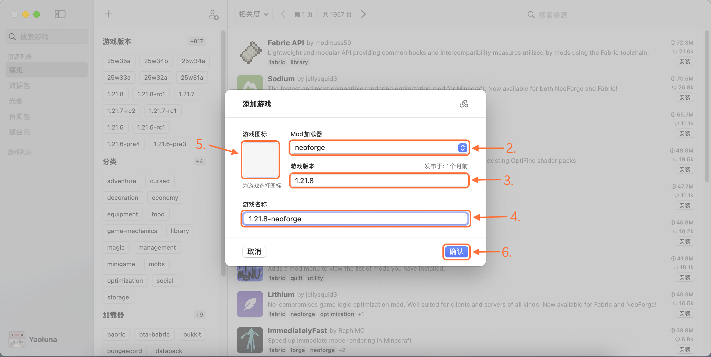
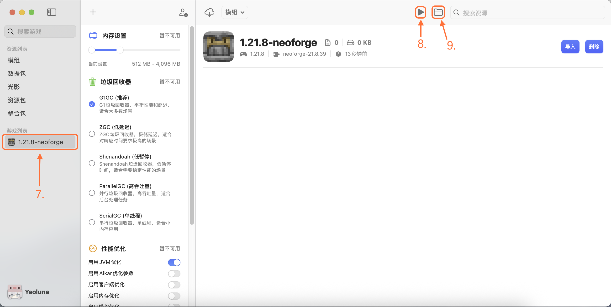

# Add Game
SCL supports installing Vanilla Minecraft as well as three types of mod loaders: NeoForge, Fabric, Forge, and Quilt.
> Vanilla: The original Minecraft without any modifications. It offers the pure, official experience and gameplay, but cannot run any mods. \
> Fabric: A rising mod loader with low performance overhead, fast updates, and quick adaptation to new versions. While it has fewer mods than Forge, its ecosystem is active, making it suitable for lightweight and modern mods. \
> Forge: A long-established mod loader with a large community and a vast number of mods. It is stable and ideal for players who want extensive mod usage. \
> NeoForge: A fork of Forge created by former Forge developers. It emphasizes modernization, open-source, and high performance. It is not compatible with higher-version Forge mods and is considered a strong competitor to Forge. \
> Quilt: An improved fork of Fabric, compatible with most Fabric mods. It aims to provide a better development experience and more advanced internal APIs.

- Click “Add Game”.

- 2–6. Select the mod loader, game version, and game name (the name displayed in the game list). You can also click the “Game Icon” area to choose an image as the game icon. Once finished, click “Confirm”.

- 7–9. Wait for the download to finish. When the newly installed version appears in the “Game List” on the left, the game has been successfully installed. You can then click “Launch” to start the game or “Path” to open the version’s folder.

