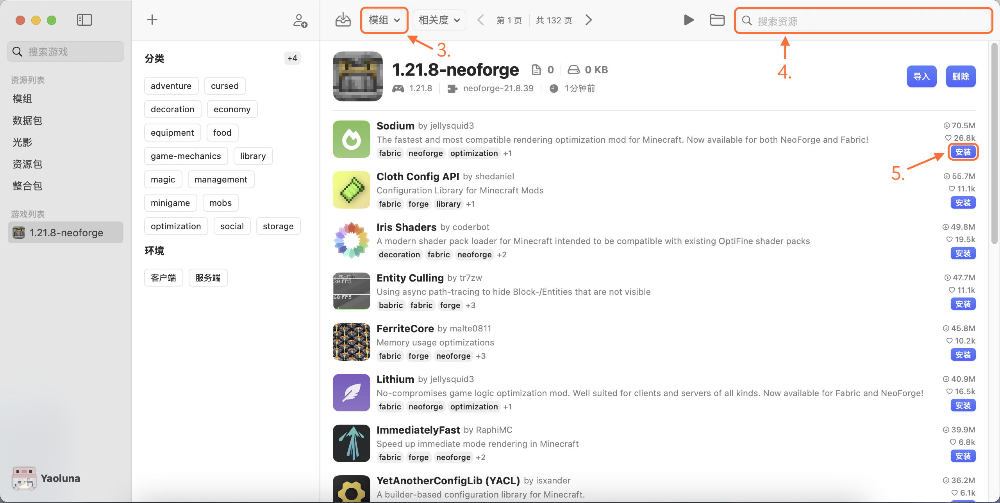
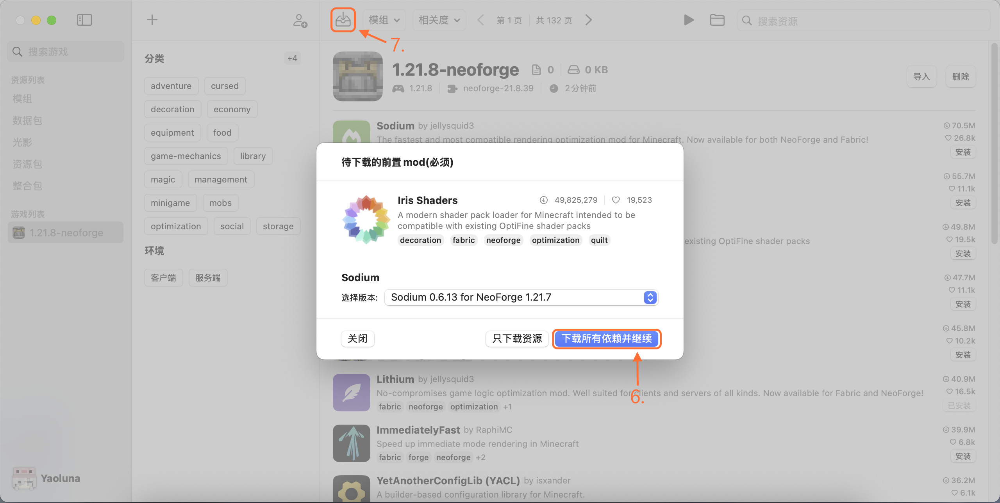
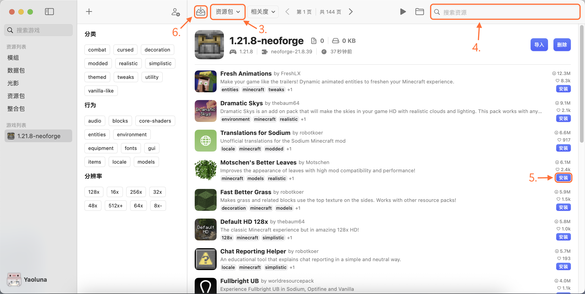
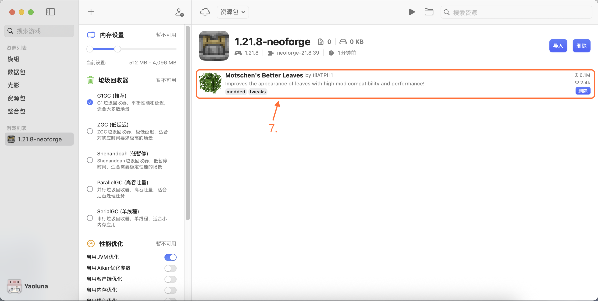
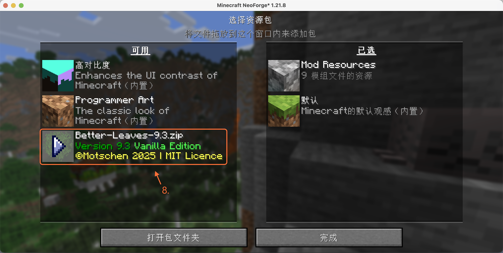
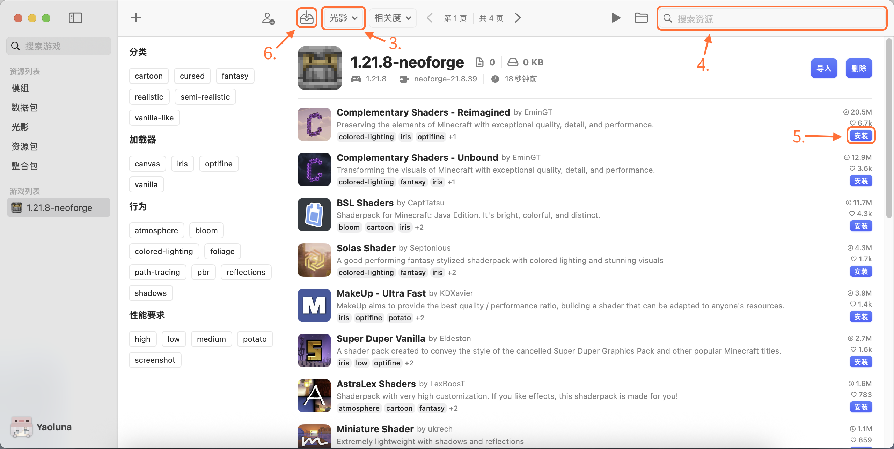
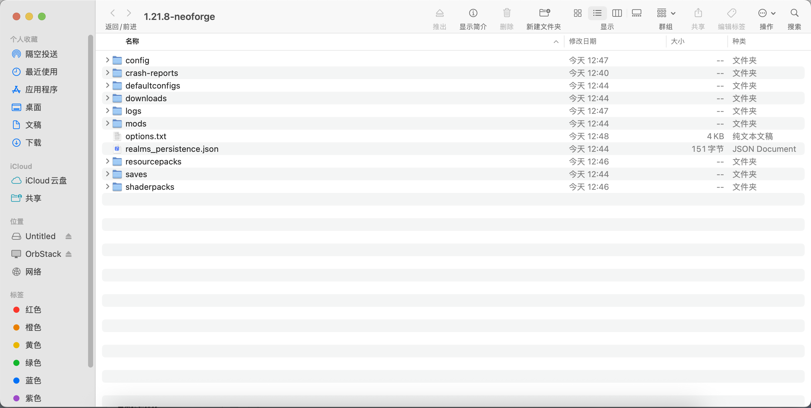

# Add Resources
SCL supports automatically downloading Mods, Resource Packs (or Texture Packs), Shaders, and Data Packs from CurseForge and Modrinth, and adding them to the game.

## 3.1 Add Mods
> Vanilla Minecraft does not support mods. Please make sure you have correctly installed a mod loader if you want to install mods.
- 1-2. In the “Game List” on the left, select the game you want to install mods for and click the top button to go to the “Resource Library.”

- 3-5. Select the “Mods” option at the top, and use the search bar on the right to find the mod you want to add. Once you’ve found the mod, click “Install.”

- 6-7. Some mods may show the interface shown in the image. This is because the mod requires other mods as dependencies to run. Don’t worry, after clicking “Download All Dependencies and Continue,” the launcher will automatically install them for you. Once the mod is installed, click the top button to return to “Installed.”

> If you don’t want to use the automatic dependency installation feature, you can turn it off in the launcher settings.
- 8.When the mod you just downloaded appears on the “Installed” page, it means the mod has been installed.

- 9.3. At this point, launching the game will show that the mod has been successfully loaded.

## 3.2 Add ResourcesPacks
- 1-2.In the “Game List” on the left, select the game you want to install the resource pack for and click the top button to go to the “Resource Library.”

- 3-6.Select the “Resource Packs” option at the top, and use the search bar on the right to find the resource pack you want to add. Once you’ve found the right resource pack, click “Install.” Once completed, click the top button to return to “Installed.”

- 7.When the “Installed” page shows the resource pack you just downloaded, it means the resource pack has been installed.

- 8.Launch the game, and you will see that the resource pack has been successfully recognized.

> Click the small triangle to load the resource pack.

## 3.3 Add Shaders
> If you want to install shaders, please make sure you have correctly installed one of the following: Optifine, Iris Shader, or Oculus.
- 1-2.In the “Game List” on the left, select the game you want to install shaders for and click the top button to go to the “Resource Library.”

- 3-6.Select the “Shaders” option at the top, and use the search bar on the right to find the shader you want to add. Once you’ve found the shader, click “Install.” After completion, click the top button to return to “Installed.”

- 7.When the “Installed” page shows the shader you just downloaded, it means the shader has been installed.

- 8.Launch the game, and you will see that the shader has been successfully recognized.

> Click on the shader you downloaded to load the shader pack.

## 3.4 Add DataPacks
> Data packs provide more ways for players to customize Minecraft’s game content, including but not limited to advancements, recipes, loot tables, enchantments, damage types, mob variants, and world generation, etc.
- * The add data pack feature is still under development. Please stay tuned...

## 3.5 Manually Add Resources
- * If you can’t find the resource you need in the Resource Library, this section is for you.
- * Please prepare your resource files first: Mods (.jar), Resource Packs (.zip), Data Packs (.zip), Shader Packs (.zip), Configuration Files (.toml, .json, .yaml, etc.), and Save Files (folders).
- 1-2. In the “Game List” on the left, select the game you want to add resources to and click the top “Path” button.

- 3.The launcher will open the “Finder” and automatically jump to the game’s directory, as shown below.

- 4. Place the resource files into their corresponding folders:

> config:Configuration files \
> mods:Mod files \
> resourcespack:ResourcesPacks files \
> saves:Saves files\
> shaderpacks:ShaderPacks files
- If you’re adding configuration files or mods, restart the game for them to take effect; the rest do not require a restart.